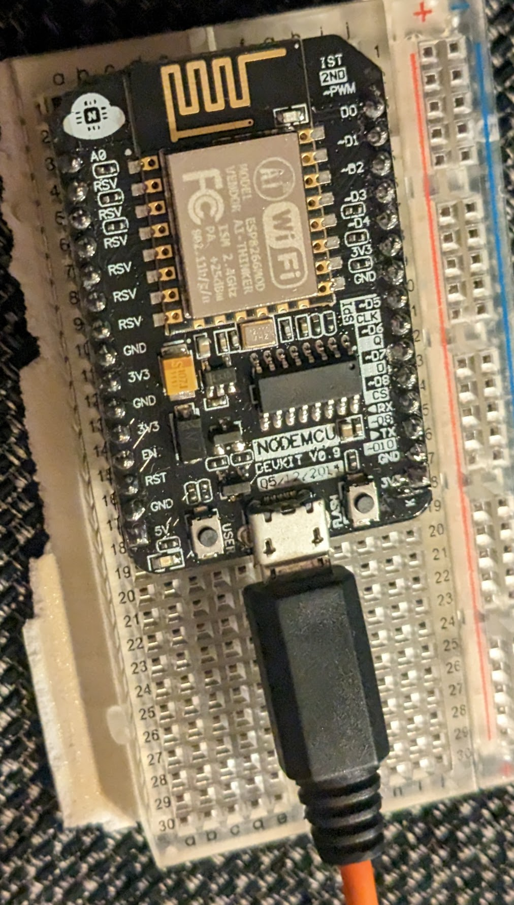
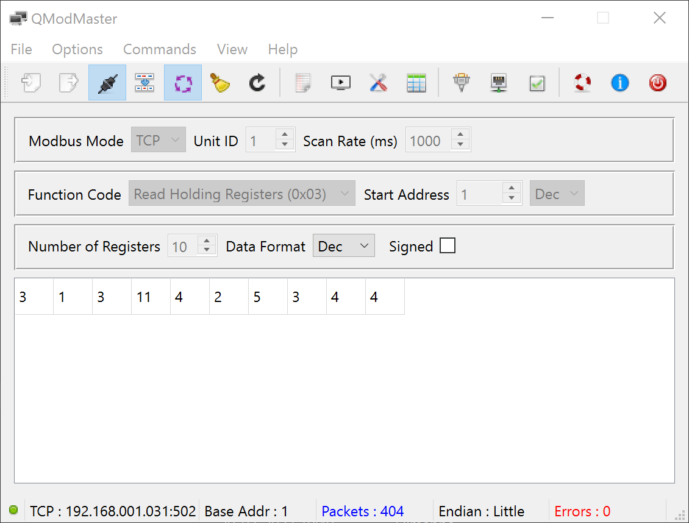
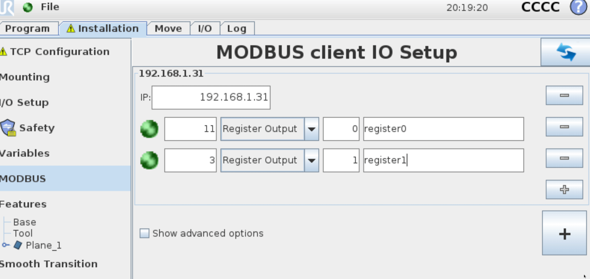
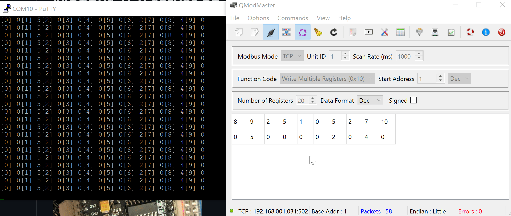

# Modbus TCP server on NodeMCU0.9
Playing with simple Modbus TCP on a NodeMCU0.9
using PlatformIO in VS-code

The code is the first 10 holding registeres [0-9] or 30001+[0-9]
you can also write to the next and they will be sent to out via the serial monitor

have fun - and remeber, only 1 client can be connected to a modbus server a time.

The good old NodeMCU0.9 :)

Testing with qModMaster, see under test folder

I also tested it with a Universal Robot CB3 sim (URSim) 
You can downloaded it from UR Homepage (https://www.universal-robots.com/)

Example on Read and Write to the modbus holding registeres

**As always... Have fun with the data and code**
